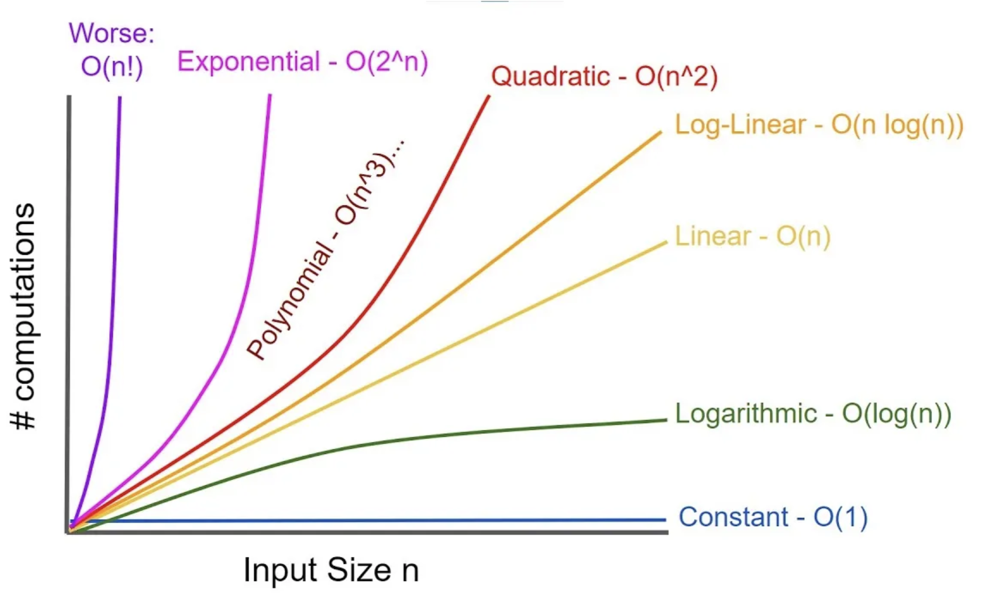

# Complexity Analysis
- Involves determining how efficient an algorithm is.
- **Time Complexity**:- How fast an algorithm runs.
- **Space Complexity**:- How much memory an algorithm takes up

## Big O Notation
- Used to describe space and time complexity
- Graph shows the complexities fastest to slowest:- 
 
- 